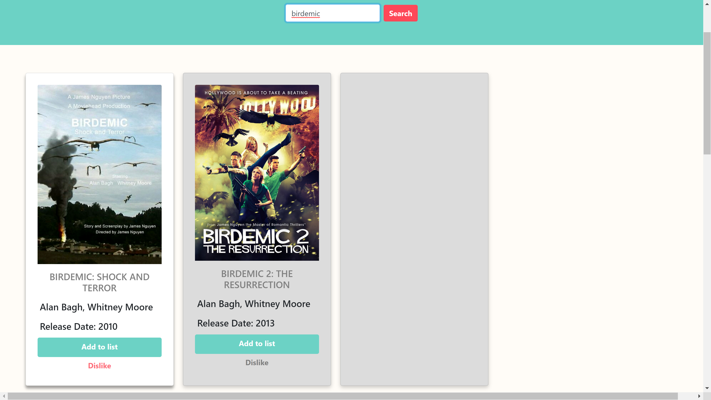
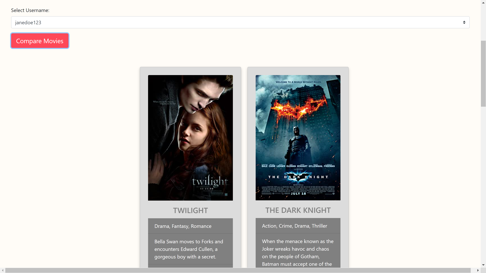

# Bootcamp_Project2

Our goal for this project was to create a social media platform that connects users by commonalities based on their favorite movies. Then with that data, users can pick a movie to watch. Our simple yet powerful interface makes finding movies and comparing with other users easy and hassle-free!

    

## Walkthrough

The user goes to our website and from there they can either sign-up for the first time or log-in as a returning user.

    

If the user is signing up for the first time they will enter a username, e-mail, and password.

    

Once the user is signed they will be taken straight to their profile, easy!

    

Our log-in screen is super straightforward and takes the user directly to their profile as well.

    

To start searching for movies simply click on "Home" link at the top left of the page and the user will be presented with a large search bar.

    

Or click on "Show me the movies!" to see a history of previously liked movies.

    

Once the search results come back the user can choose to like or dislike the movie. Liking the movie will add it directly to their profile page whereas clicking dislike will erase it from the results.

    

If the user wanted to compare movies with another user they just need to click on "Select Username" and the dropdown menu will list other users on the application. After choosing, click on "Compare Movies" and any movies that both individuals have liked will populate the area below. If no results are shown then unfortunately that means they have different tastes.

    

When the user is ready to watch a movie they just need to navigate back to their "Profile" page, click on "Show me the movies!", pick a movie listed, and they can just click on their streaming service prference to be taken straight to their movie! Enjoy!

    

## Technologies Used

HTML,
CSS,
BOOTSTRAP FRAMEWORK,
JAVASCRIPT,
MYSQL,
EXPRESS,
PASSPORT,
SEQUELIZE,
HANDLEBARS,
HEROKU,

    

## Credits 

Kalen, David, Bronson, Michael

