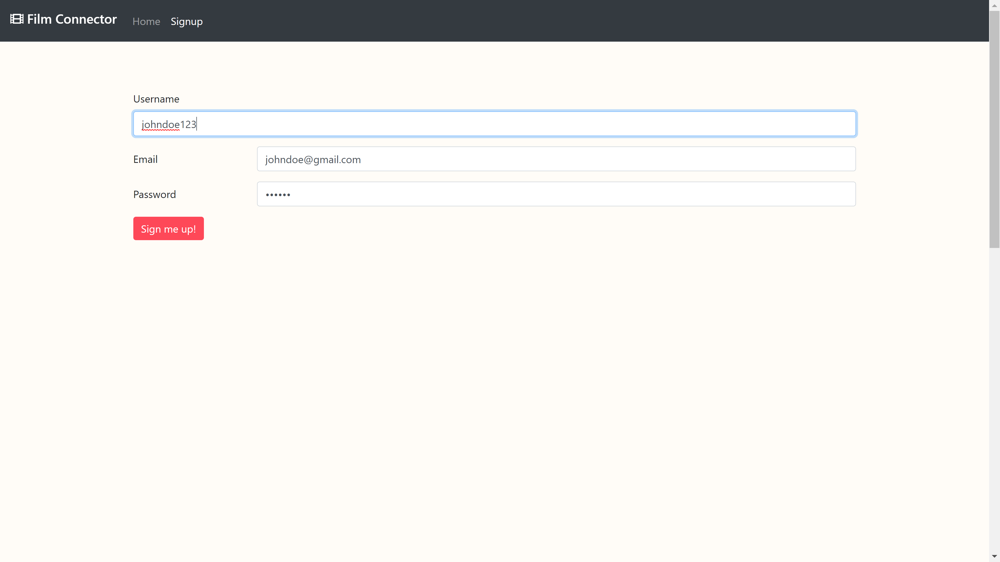
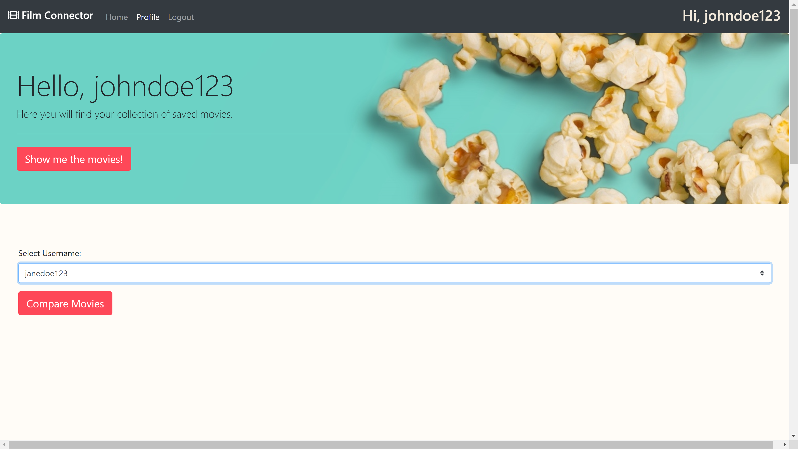
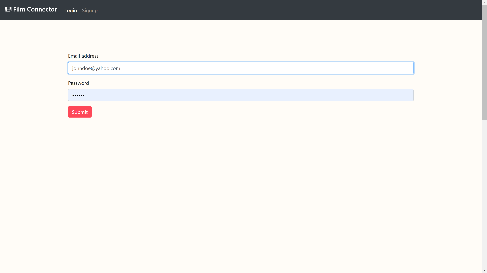
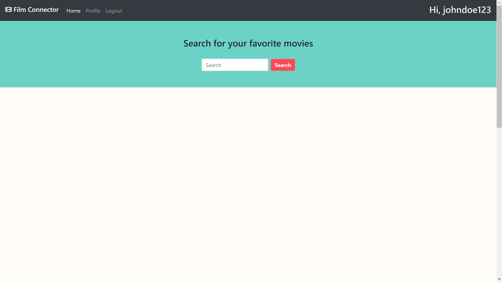

# Bootcamp_Project2

Our goal for this project was to create a social media platform that connects users by commonalities based on their favorite movies. Then with that data, users can pick a movie to watch. Our simple yet powerful interface makes finding movies and comparing with other users easy and hassle-free!

## Walkthrough

The user goes to our website and from there they can either sign-up for the first time or log-in as a returning user.

  

If the user is signing up for the first time they will enter a username, e-mail, and password.

  

Once the user is signed they will be taken straight to their profile, easy!

Our log-in screen is super straightforward and takes you directly to your profile as well.

To start searching for movies simply click on "Home" link at the top left of the page and you'll be presented with a large search bar.

Or click on "Show me the movies!" to see a history of previously liked movies.

